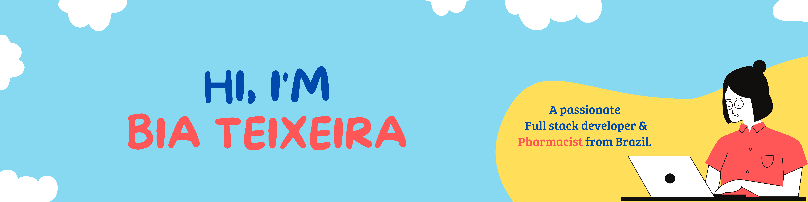

    

 
 

Graduated in Pharmacy since 2011, I worked in the pharmaceutical market, in several sectors, and I always had an energy for change, I was never content to accept things as they are, because of that the other specializations I studied were always focused on creating something that added value to what I performed and collaborated in changing processes. The interaction with technology came with the system validation activities, where we carry out tests as users to implement new software in the processes, confronting the current legislation. This contact with software made me understand the potential that technology has to change things.

 
<h1>I'm current learning:</h1>
    
👩‍💻 Languages

    <li>
         
         
         
         
    </li>
 
    
⚡ Database

    <li>
         
    </li>
 
    
🚀 Frameworks & Library

    <li>
        
        
        
    </li>
 
  
🖍 Design tools

    <li>
       
       
    </li>
 
<h2>📊 Statistics</h2>
    
 
<h2>📱 Contact</h2>
    <li>
        
        
        
    </li>
